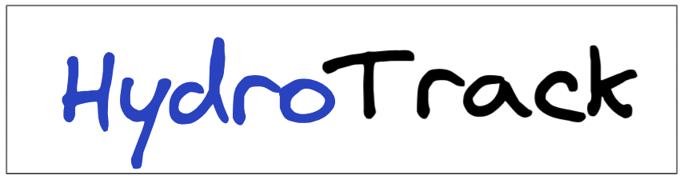
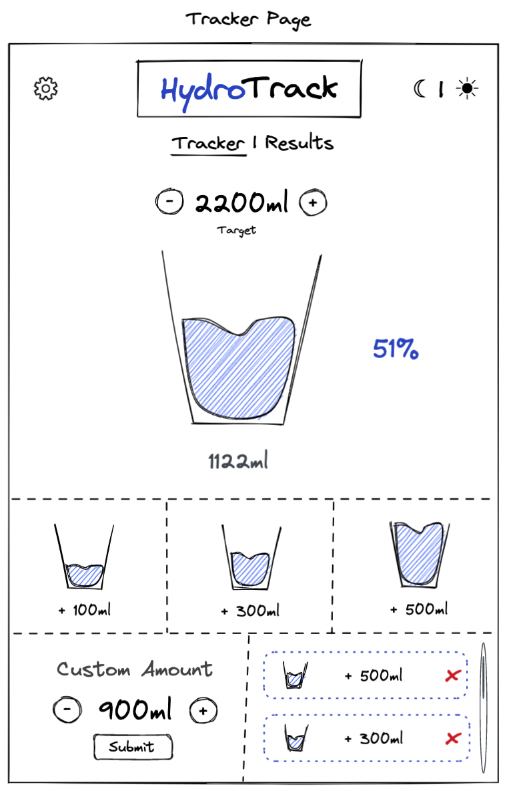
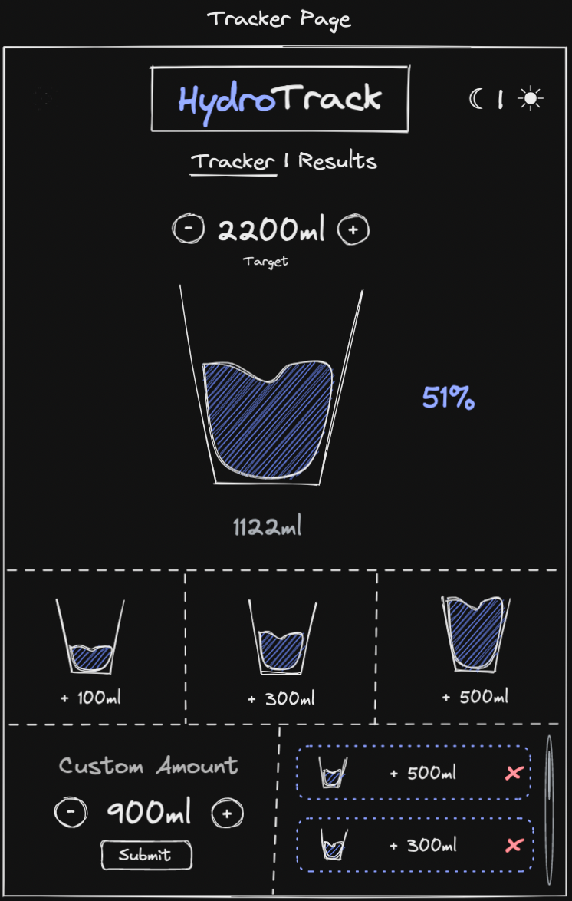
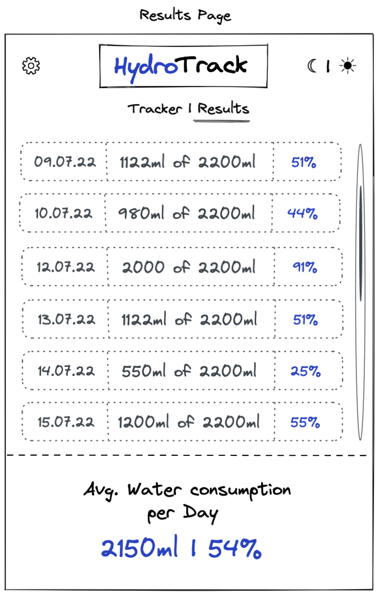
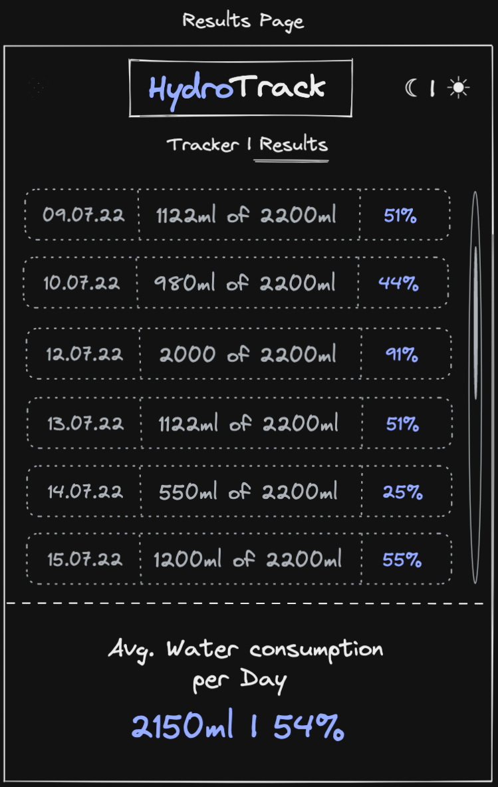
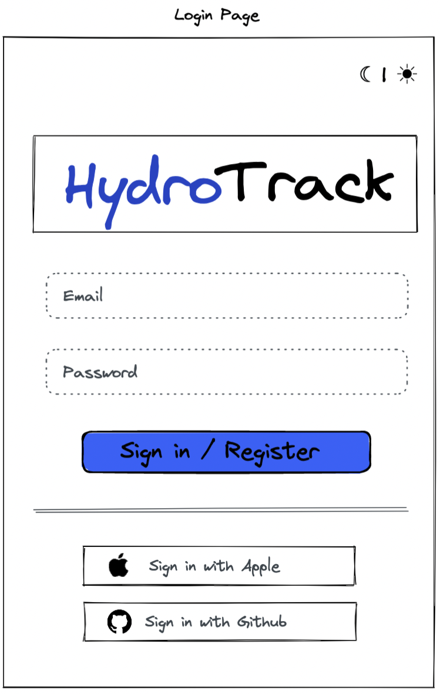
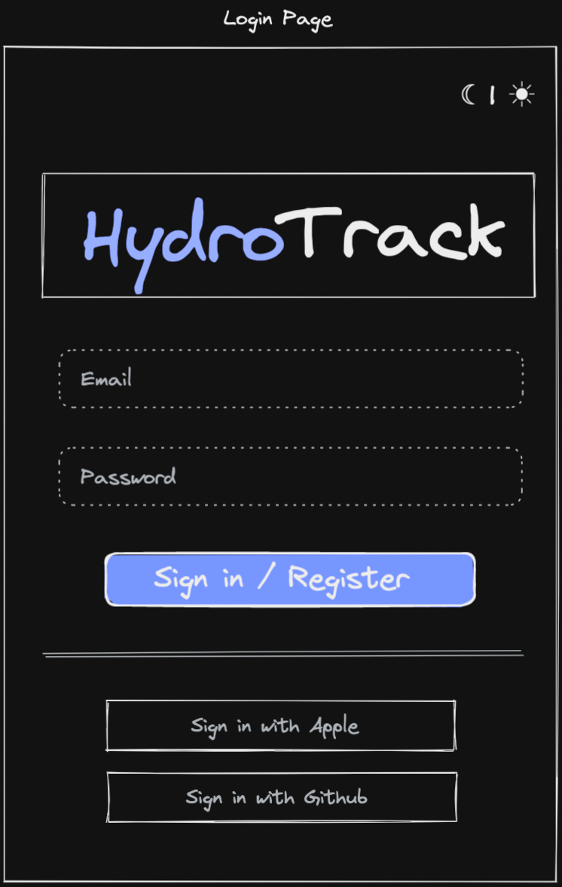
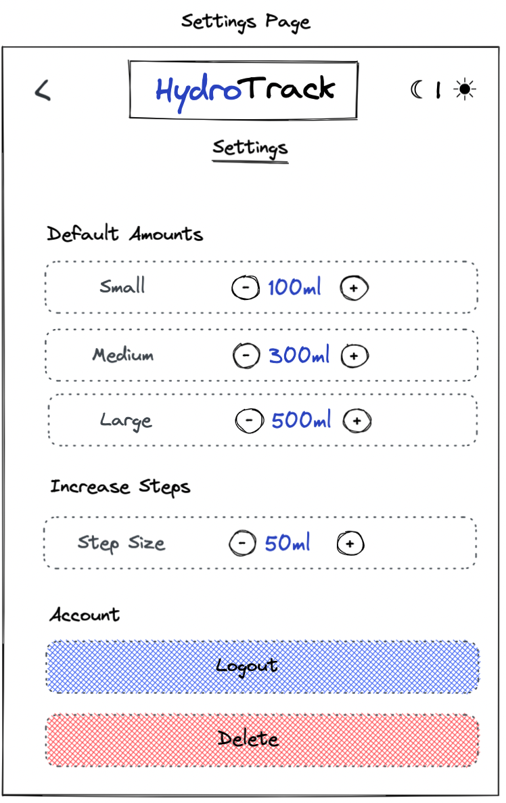
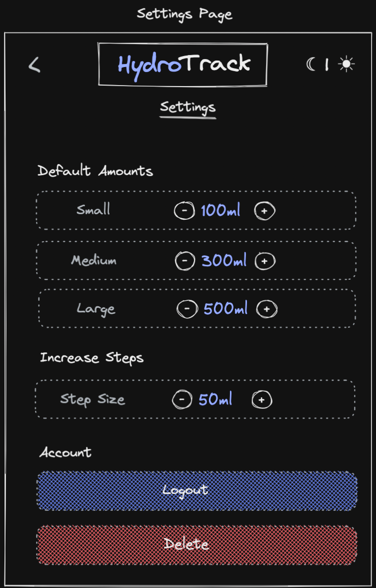

# HydroTracker - Water Consumption App

This is an app bootstrapped according to the [init.tips](https://init.tips) stack, also known as the T3-Stack.

The building process for this web app will help me understand the Technology Stack better.

The Stack includes:

-   [Next.Js](https://nextjs.org/)
-   TypeScript
-   [Tailwind CSS](https://tailwindcss.com/)
-   [tRPC](https://trpc.io/)
-   [Prisma](https://www.prisma.io/)
-   [NextAuth](https://next-auth.js.org/)
-   PostgreSQL

For the deployment I use [Railway](https://railway.app/)

## Mockups

The mockups were created with [Excalidraw](https://excalidraw.com/). The excalidraw file can be found in the [assets folder](./assets/HydroTrack.excalidraw)

|                           Main Light                           |                              Main Dark                              |
| :------------------------------------------------------------: | :-----------------------------------------------------------------: |
|  |  |

|                           Results Light                            |                              Results Dark                               |
| :----------------------------------------------------------------: | :---------------------------------------------------------------------: |
|  |  |

|                           Login Light                            |                              Login Dark                               |
| :--------------------------------------------------------------: | :-------------------------------------------------------------------: |
|  |  |

|                             Settings Light                             |                                Settings Dark                                |
| :--------------------------------------------------------------------: | :-------------------------------------------------------------------------: |
|  |  |

## Targets
